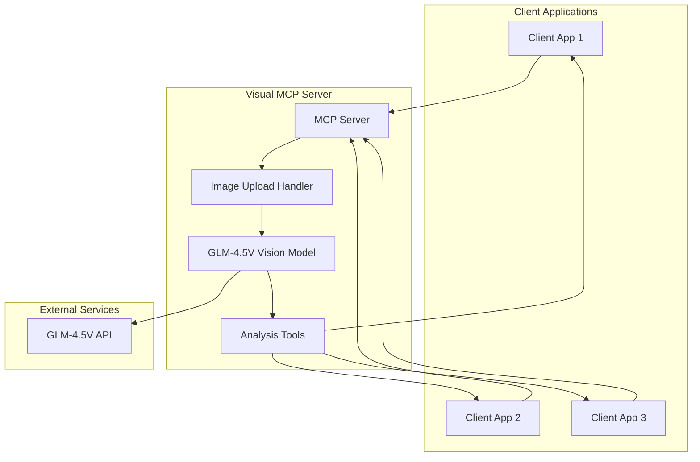

# Visual MCP Server

An MCP (Model Context Protocol) server that provides unified multimodal image analysis using GLM-4.5V vision model. Just upload an image with context about what you want to know, and the AI figures out the best approach.

## Features

- **Unified Tool**: One `analyze_image_with_context` tool for all image analysis needs
- **Smart Analysis**: AI automatically determines whether to extract text, analyze diagrams, describe images, or summarize content
- **Flexible Context**: Provide natural language context about what you want to know
- **Multiple Input Formats**: Support for base64, file paths, and data URLs
- **No Local Processing**: Pure MCP-to-LLM architecture with minimal dependencies

## Project Structure

```
visual-mcp/
├── src/visual_mcp/          # Source code
│   ├── __init__.py         # Package init
│   ├── main.py            # Entry point
│   └── server.py          # MCP server implementation
├── tests/                   # Test suite
│   ├── __init__.py
│   └── test_server.py
├── examples/                # Example scripts
│   └── example_usage.py
├── docs/                   # Documentation
│   ├── CLAUDE_DESKTOP_SETUP.md
│   ├── PROJECT_SUMMARY.md
│   └── CRUSH.md
├── .env.example           # Environment template
├── pyproject.toml         # Project config
└── .gitignore            # Git ignore rules
```

## Setup

### Prerequisites

- Python 3.11 or later
- [uv](https://docs.astral.sh/uv/) package manager

### Installation

Using the Makefile (recommended):

```bash
# Install dependencies and setup development environment
make install

# For quick setup (alias for install)
make setup-dev
```

Manual installation:

```bash
# Install dependencies
uv sync

# Install pre-commit hooks
uv run pre-commit install
```

## Development Workflow

The project includes a comprehensive Makefile to streamline development tasks:

### Quick Start

```bash
# Install everything
make install

# Run the development server
make dev

# Run tests
make test

# Check code quality
make check-all
```

### Common Development Tasks

```bash
# Code Quality Checks
make lint            # Run linting with ruff
make format          # Format code with ruff  
make type-check      # Run type checking with mypy
make check-all       # Run all checks (lint + format + type-check)

# Testing
make test            # Run tests with coverage
make test-watch      # Run tests in watch mode (continuous testing)

# Server Operations
make dev             # Run development MCP server
make run-server      # Run production MCP server

# Build & Release
make build           # Clean and build distribution package
make wheel           # Quick wheel build for MCP testing
make clean           # Remove all build artifacts and caches

# Examples
make example         # Run example usage script
```

### Manual Commands (Alternative to Makefile)

```bash
# Run development server
uv run mcp dev src/visual_mcp/server.py

# Run tests with coverage
uv run pytest tests/ -v --cov=src/visual_mcp

# Code quality
uv run ruff check src/ tests/
uv run ruff format src/ tests/
uv run mypy src/ tests/

# Build distribution
uv build

# Run example
uv run python examples/example_usage.py
```

## Claude Desktop Integration

For detailed instructions on integrating with Claude Desktop, see **[docs/CLAUDE_DESKTOP_SETUP.md](docs/CLAUDE_DESKTOP_SETUP.md)**.

### Quick Setup

See **[docs/CLAUDE_DESKTOP_SETUP.md](docs/CLAUDE_DESKTOP_SETUP.md)** for detailed instructions.

#### Option 1: Simple Installation (Recommended)

Add this configuration to Claude Desktop:

```json
{
  "mcpServers": {
    "visual-mcp": {
      "command": "uvx",
      "args": ["visual-mcp"],
      "env": {
        "GLM_API_KEY": "your-api-key-here",
        "GLM_MODEL_NAME": "glm-4.5v"
      }
    }
  }
}
```

#### Option 2: Using Built Wheel (Advanced)

For development or using a specific version, build the wheel first:

```bash
# Build the wheel package
uv build
```

Then add this configuration to Claude Desktop:

```json
{
  "mcpServers": {
    "visual-mcp": {
      "command": "uvx",
      "args": ["--from", "dist/visual_mcp-0.1.0-py3-none-any.whl", "visual-mcp"],
      "env": {
        "GLM_API_KEY": "your-api-key-here",
        "GLM_MODEL_NAME": "glm-4.5v"
      }
    }
  }
}
```

The `--from` flag tells `uvx` to use the specific wheel file instead of downloading from PyPI. This is useful for:
- Testing local builds
- Using specific versions
- Development workflows
- Offline installations

### Environment Variables

- **`GLM_API_KEY`** (Required): Your GLM API key from [https://z.ai/model-api](https://z.ai/model-api)
- **`GLM_MODEL_NAME`** (Optional): Model name to use (default: `glm-4.5v`)
  - Available models: `glm-4.5v`, `glm-4v`, `glm-4-air`, `glm-4-airx`
  - Different models have varying capabilities and costs

## Usage

### The Unified Tool: `analyze_image_with_context`

Instead of multiple specialized tools, simply use one tool with natural language context:

**Parameters:**
- `image_data`: Base64 encoded image data, file path, or data URL
- `user_context`: What you want to know - be specific about your needs
- `max_tokens`: Maximum tokens in response (default: 3000)

### Example Contexts:

**Text Extraction:**
- "Extract and summarize all text in this document"
- "What does this contract say about termination clauses?"
- "Transcribe all handwritten text in this image"

**Diagram Analysis:**
- "Analyze this architecture diagram and explain the system flow"
- "Explain this UML diagram focusing on class relationships"
- "What's the logic shown in this flowchart?"

**General Description:**
- "Describe this photo focusing on people and setting"
- "What colors and composition do you see in this painting?"
- "Identify the main objects in this image"

**Problem Solving:**
- "What's wrong with this code screenshot?"
- "Identify safety issues in this workplace photo"
- "Find errors in this mathematical diagram"

**Educational Content:**
- "Explain this scientific diagram step by step"
- "Teach me about the components shown in this image"
- "Break down this complex visual for a beginner"

## Architecture



## API Key Configuration

Set your GLM-4.5V API key in environment variables:

```bash
# Get your API key from https://z.ai/model-api
export GLM_API_KEY="your-api-key-here"

# Optional: Use BigModel platform instead
# export GLM_API_BASE="https://open.bigmodel.cn/api/paas/v4"
```